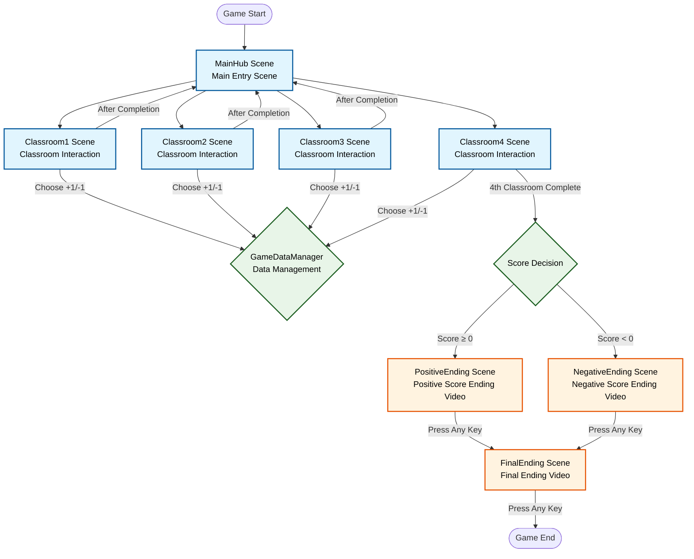
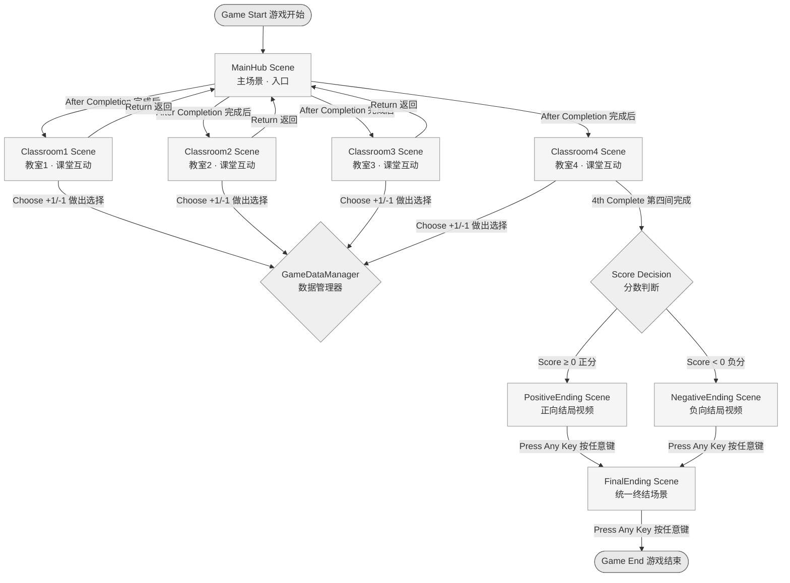
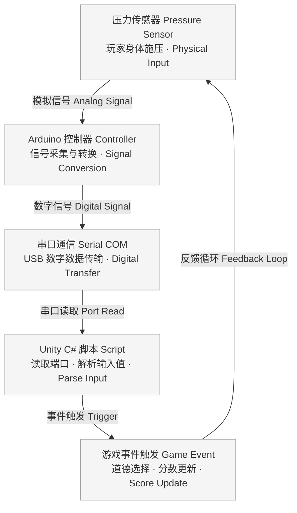

## Project description ##


Lucid Dream is a first-person interactive game that explores the psychological conflict between institutional roles and personal identity. Players enter a recurring dream as a teacher, repeatedly encountering morally ambiguous scenarios across eight scenes. They must decide whether to intervene in strange student behaviors or remain passive. Regardless of their choices, the cycle always ends with awakening and returning to reality. Motion sensors enhance immersion by allowing body-based interaction.

This project asks how institutional expectations infiltrate our subconscious decision-making, and what happens when we begin to recognize these influences. It aims to reveal the often unnoticed psychological mechanisms that shape our daily negotiations between authentic self-expression and social conformity.

Throughout the continuous refinement of the game’s narrative structure to ensure internal consistency, I have gained a clearer understanding of the interactive dynamics between the game and the player, as well as the mechanisms and pathways through which thematic intent and the designer’s vision can be effectively conveyed. I have learned how to use both surface-level visual tension and deeper interaction design logic to quickly immerse players in the virtual environments I create. At the same time, I have become increasingly familiar with the entire game development pipeline, particularly in areas such as branching narrative structures, player choice systems, and behavioral feedback loops. I came to recognize the crucial role that game scripting plays in shaping player experience and advancing the storyline—it serves as a vital bridge between design and player interaction. Most practically, my ability to work with the Unity engine has become more fluent and efficient, allowing me to configure and integrate various components seamlessly and build more mature, structurally cohesive game projects. Meanwhile, I have continued to grow in my strengths—visual storytelling and user experience design—successfully integrating them with newly acquired technical skills to produce works that are both expressive and highly playable.

## Technical description ##

The project was developed in Unity using a first-person controller, modular C# scripts(Visual Studio Code), and context-based UI logic. A pressure sensor captures real-time physical input, enabling players to make moral decisions through embodied interaction rather than traditional clicking. The scene system includes branching choices, automated transitions, and interactive prompts. Custom-designed classroom and office environments incorporate lighting effects, character animations, and spatial audio to enhance narrative immersion. By combining physical input with symbolic dream sequences, the project creates a hybrid experience in which digital structure and individual agency intersect.

My main contribution was integrating the overall game framework, designing all interaction mechanics and underlying game logic, as well as creating the entire user interface. I was also responsible for designing all in-game animations and narrative cutscenes, along with the two abnormal classroom scenes.（See the relevant section under team roles for more details.）

#### Interactive Game Architecture
I refined my original flow sketches into an improved and fully visualized version.





#### Script Structure
| Scene/System | Script Name | Purpose | Status |
|--------------|-------------|---------|--------|
| **All Scenes** | `GameDataManager.cs` | Global data management, score tracking, scene transitions | Core |
| **MainHub** | `ClassroomEntrance.cs` | Classroom entrance button control and status display | Core |
| **MainHub** | `MainHubUI.cs` | Hub scene UI status and progress display | Secondary |
| **Classroom1-8** | `ClassroomController.cs` | In-classroom audio, UI interaction, choice handling | Core |
| **Ending Scenes** | `EndingVideoController.cs` | Video playbook, frame holding, transition control | Core |
| **MainMenu** | `MainMenuController.cs` | Start screen with dual interface system | Secondary |
| **MainMenu** | `SimpleMenuController.cs` | Simplified menu controller alternative | Secondary |
| **IntroVideo** | `VideoManager.cs` | Introduction video playback and skip functionality | Secondary |
| **Utility** | `SceneLoader.cs` | Scene loading with transition effects | Enhancement |


#### Game Flow

```
Start Game → MainHub displays 8 classroom buttons
       ↓
Select Classroom → Enter corresponding Classroom scene
       ↓  
Play Audio → Show UI → Player Choice (+1/-1) → Return to MainHub
       ↓
Repeat process until 8 classrooms completed
       ↓
Trigger Ending → Play corresponding ending video based on total score
       ↓
Press Any Key → Play final ending video
       ↓
Press Any Key → Game End
```
#### Features  
**1. Singleton Pattern**: GameDataManager cross-scene data persistence  
**2. Audio Control**: UI appears after classroom audio playback completion  
**3. UI Interaction**: Code-based button event binding with hide/show support  
**4. State Management**: Real-time tracking of classroom completion status and score accumulation  


## Project Images ##


## Demo Video ##


https://git.arts.ac.uk/24014203/Xiaoya_FAN-Responsive-Environments-Blog-2024/assets/1366/adfd0d2c-76ce-4067-8d57-e6a31147b138


## Playtest Results & Revision Plan ##


We conducted user testing with six participants, including four design students and two non-design peers. Each session lasted around 10 minutes, allowing players to experience two full dream scenes. Observations focused on clarity of interaction, emotional engagement, and narrative comprehension.

Most users described the atmosphere as immersive and emotionally tense. However, some were confused by the “care” and “ignore” buttons, unsure how their choices would impact the story. Two participants became disoriented when returning from the classroom scene, and one user was unsure how their actions contributed to the final outcome.

Based on this feedback, we propose several adjustments:

- Add short on-screen text when entering classrooms to clarify the meaning of each button
- Improve scene transitions using environmental cues such as lighting and sound direction
- Include a lightweight visual summary before the final video to suggest how prior choices influence the ending

The 10-minute format proved effective for capturing one full “dream loop” from entry to awakening. This short cycle supports focused attention and encourages clearer reflection, while informing design improvements that enhance orientation, narrative coherence, and emotional payoff.

## Link to all project files and assets
- [Game application - Google Drive](https://drive.google.com/file/d/1qq2Swx5DCWnxEPIHd6sKwHGcDGJXsjka/view?usp=sharing)  
- [Data files - Google Drive](https://drive.google.com/drive/folders/1fNleC2e06W-F33k5AQjpfefpVCCBjjTr?usp=sharing)

## Sprint 1 & Sprint 2 Documentation
- [Sprint 1](https://git.arts.ac.uk/24007733/Responsive-Environments-Blog-2024/blob/main/week5-Sprint1.md)  
- [Sprint 2](https://git.arts.ac.uk/24007733/Responsive-Environments-Blog-2024/blob/main/week10-Sprint2.md)  

## ChatGPT Log
- [ChatGPT log](https://chatgpt.com/share/685c4d2c-aaec-8013-b763-195e33e77087)<br>
- [ChatGPT log](https://chatgpt.com/share/685c5a8f-9a74-8009-b91d-9ef00b22f404)<br>
- [ChatGPT log](https://claude.ai/share/727c06c4-7d6a-4a19-9ff1-7cff7e01b0b7)


