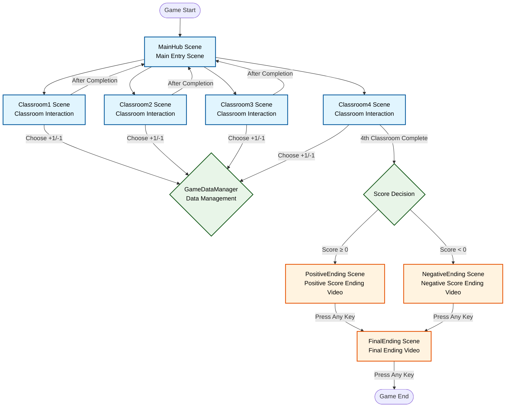

# Unity Classroom Interactive Game Complete Architecture



## Game Overall Architecture

### Scene Structure
```
Unity Classroom Interactive Game
├── MainHub Scene (Main Entry Scene)
├── Classroom1 Scene (Classroom 1)
├── Classroom2 Scene (Classroom 2)  
├── Classroom3 Scene (Classroom 3)
├── Classroom4 Scene (Classroom 4)
├── Classroom...
├── PositiveEnding Scene (Positive Score Ending)
├── NegativeEnding Scene (Negative Score Ending)
└── FinalEnding Scene (Final Ending)
```

### Core Script Dependencies

| Scene Type | Main Script | Purpose |
|------------|-------------|---------|
| **MainHub** | `ClassroomEntrance.cs` | Classroom entrance button control |
| **Classroom1-4** | `ClassroomController.cs` | In-classroom audio UI interaction |
| **All Scenes** | `GameDataManager.cs` | Global data and scene management |
| **Ending Scenes** | `EndingVideoController.cs` | Video playback and transition control |

### Game Flow

```
Start Game → MainHub displays 8 classroom buttons
       ↓
Select Classroom → Enter corresponding Classroom scene
       ↓  
Play Audio → Show UI → Player Choice (+1/-1) → Return to MainHub
       ↓
Repeat process until 8 classrooms completed
       ↓
Trigger Ending → Play corresponding ending video based on total score
       ↓
Press Any Key → Play final ending video
       ↓
Press Any Key → Game End
```

### Technical Features

- **Singleton Pattern**: GameDataManager cross-scene data persistence
- **Audio Control**: UI appears after classroom audio playback completion
- **UI Interaction**: Code-based button event binding with hide/show support
- **Video Playback**: RenderTexture method for fullscreen ending video playback
- **State Management**: Real-time tracking of classroom completion status and score accumulation
- **Debug System**: Complete keyboard shortcut testing functionality
