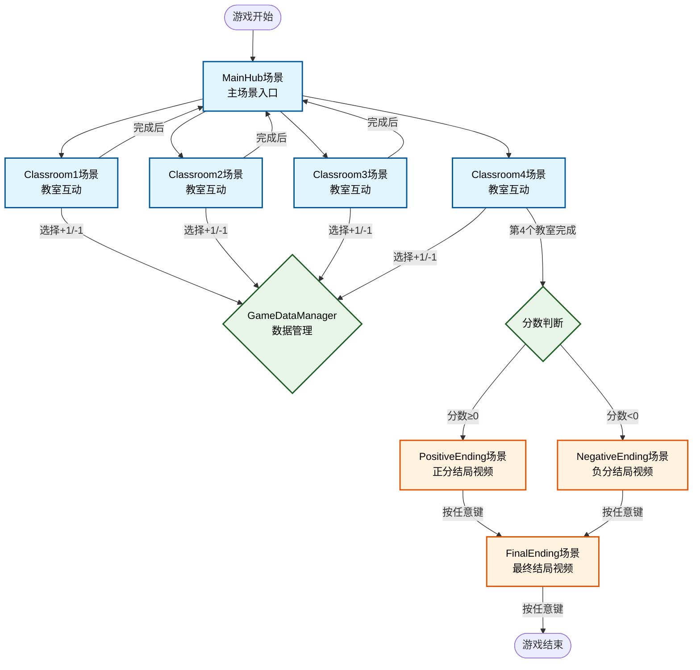

# Week 19

### Labs

# Unity教室互动游戏完整架构图



###  场景结构
```
Unity教室互动游戏
├── MainHub场景 (主入口场景)
├── Classroom1场景 (教室1)
├── Classroom2场景 (教室2)  
├── Classroom3场景 (教室3)
├── Classroom4场景 (教室4)
├── PositiveEnding场景 (正分结局)
├── NegativeEnding场景 (负分结局)
└── FinalEnding场景 (最终结局)
```

### 核心脚本依赖

| 场景类型 | 主要脚本 | 作用 |
|---------|----------|------|
| **MainHub** | `ClassroomEntrance.cs` | 教室入口按钮控制 |
| **Classroom1-4** | `ClassroomController.cs` | 教室内音频UI交互 |
| **所有场景** | `GameDataManager.cs` | 全局数据和场景管理 |
| **结局场景** | `EndingVideoController.cs` | 视频播放和跳转控制 |

### 游戏流程

```
开始游戏 → MainHub显示4个教室按钮
       ↓
选择教室 → 进入对应Classroom场景
       ↓  
播放音频 → 显示UI → 玩家选择(+1/-1) → 返回MainHub
       ↓
重复流程直到完成4个教室
       ↓
触发结局 → 根据总分播放对应结局视频
       ↓
按任意键 → 播放最终结局视频
       ↓
按任意键 → 游戏结束
```

